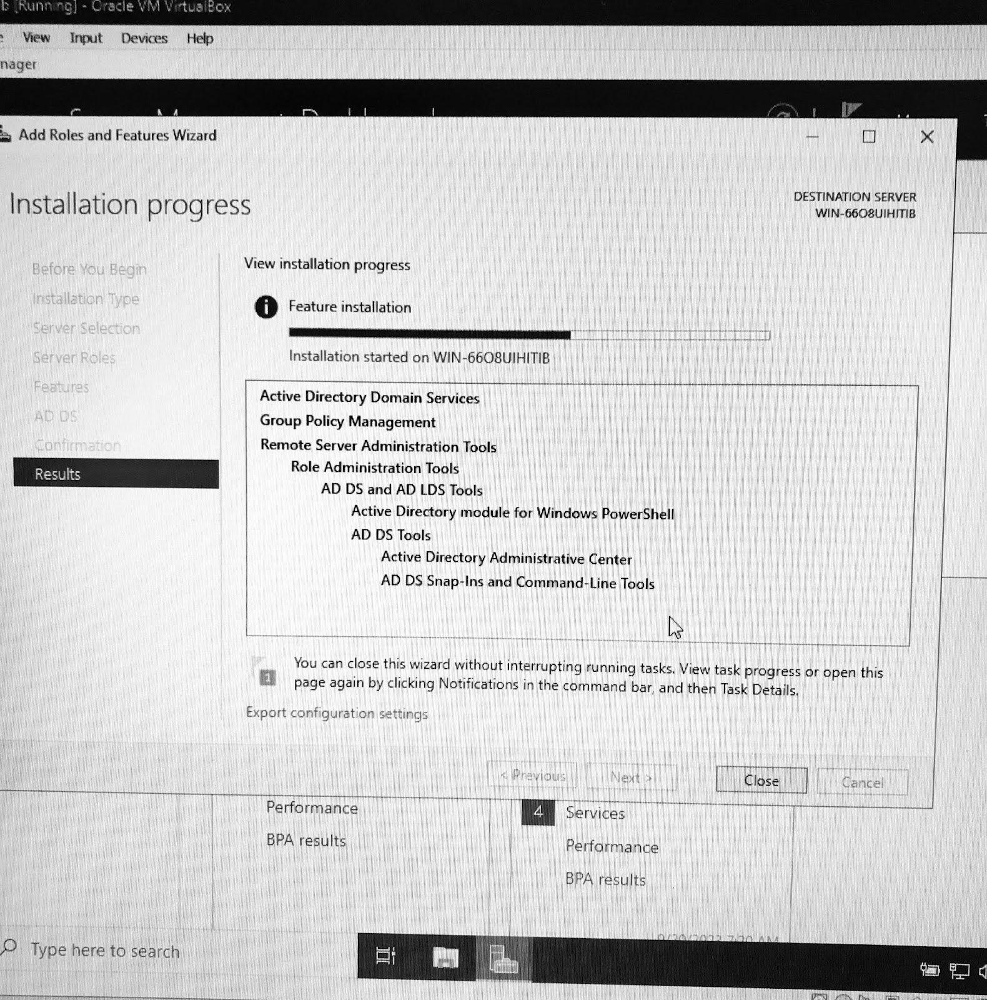

# Writing Good Documentation

# Step 1 | Using Codeblocks.

Codeblocks in markdwon make it *very easy* for tech people to **copy, paste, share** code.
A good __Cloud Engineer__ usees Codeblocks whenever possible.

Because it allows others to copy and paster heir code to replicate or research issues.

- In order to create codeblocks in markdown you need to use three backticks (```). These marks are not single quotations ('''). <sup>[1]</sup>
```
def factorial(n):
    if n == 0:
        return 1
    else:
        return n * factorial(n - 1)

# Test the factorial function
number = 5
result = factorial(number)
print(f"The factorial of {number} is {result}")

```
When you can, apply syntax highligting to your codeblocks. Use this format:
```python
def factorial(n):
    if n == 0:
        return 1
    else:
        return n * factorial(n - 1)

# Test the factorial function
number = 5
result = factorial(number)
print(f"The factorial of {number} is {result}")
```


Good Cloud Engineers use codeblocks for both code and erros that appear in the console.

```javascript
Uncaught TypeError: Cannot read property 'middleName' of undefined
    at script.js:6
```
> Here is an example of using a codeblock for an error that appears in the console.

# Step 2 | How to Take Screenshots 

A screeenshot is when you capture a part of your screen from you phone, laptop, or desktop.
Not to be confused with taking a picture with your phone.

**What NOT to do**


The proper way


# Step 3 | Use Github Flavored Markdown (GFM) Task Lists
Github extends Markdown to have list where you can check off items. [<sup>[3]</sup>](##external-references)

- [x] Finish step 1
- [ ] Finish step 2
- [ ] Finish step 3

# Step 4 | Use Emojis <sup>[4]</sup>
GFM supports emoji shortcuts.
Some examples are:

| Name | Shortcode | Emoji |
| --- | --- | --- |
| Cloud | `:cloud:` |:cloud:|
| Unicorn | `:unicorn:` | :unicorn: |
| Star (2) | `:star2:`| :star2:	|


# Step 5 | How to Create a Table <sup>[5]</sup>

You can use the following markdwon format to create tables:
```md
| Name | Shortcode | Emoji |
| --- | --- | --- |
| Cloud | `:cloud:` | ☁️ |
```
Github extends the functionality of Markdown tables to provide more alignment and table cell formatting options. <sup>[5]</sup>

# External References <sup>[2]</sup>
- [Basic writing and formatting syntax](https://docs.github.com/en/get-started/writing-on-github/getting-started-with-writing-and-formatting-on-github/basic-writing-and-formatting-syntax) <sup>[1]</sup>
- [Relative links](https://docs.github.com/en/get-started/writing-on-github/getting-started-with-writing-and-formatting-on-github/basic-writing-and-formatting-syntax#relative-links) <sup>[2]</sup>
- [GFM - Task Lists](https://docs.github.com/en/get-started/writing-on-github/getting-started-with-writing-and-formatting-on-github/basic-writing-and-formatting-syntax#task-lists) <sup>[3]</sup>
- [GFM - Emjoi Cheat Sheet](https://github.com/ikatyang/emoji-cheat-sheet/blob/master/README.md) <sup>[4]</sup>
- [GFM - Tables (extensions)](https://github.github.com/gfm/#tables-extension-) <sup>[5]</sup>
