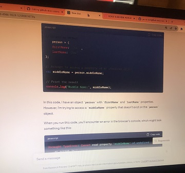
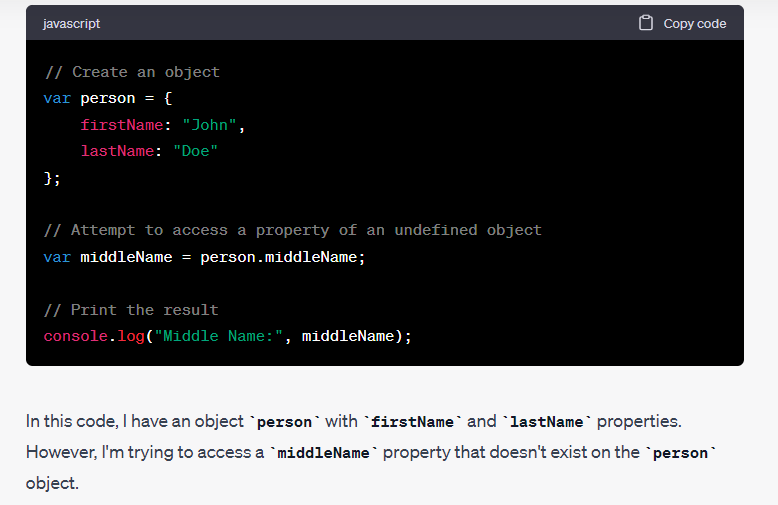

# Writing Good Documentation

# Step 1 | Using Codeblocks.

Codeblocks in markdwon make it *very easy* for tech people to **copy, paste, share** code.
A good __Cloud Engineer__ usees Codeblocks whenever possible.

Because it allows others to copy and paster heir code to replicate or research issues.

- In order to create codeblocks in markdown you need to use three backticks (```). These marks are not single quotations ('''). <sup>[1]</sup>
```
def factorial(n):
    if n == 0:
        return 1
    else:
        return n * factorial(n - 1)

# Test the factorial function
number = 5
result = factorial(number)
print(f"The factorial of {number} is {result}")

```
Apply syntax highligting to your codeblocks when you can.
```python
def factorial(n):
    if n == 0:
        return 1
    else:
        return n * factorial(n - 1)

# Test the factorial function
number = 5
result = factorial(number)
print(f"The factorial of {number} is {result}")
```


Good Cloud Engineers use codeblocks for both code and erros that appear in the console.

```javascript
Uncaught TypeError: Cannot read property 'middleName' of undefined
    at script.js:6
```
> Here is an example of using a codeblock for an error that appears in the console.

When you can always provide a codeblock instead of a screenshot.
If your need to take a screenshot make sure its not a photo from your phone.

> There are certain cases where its okay to take photos with your phone. This is when you are showing something like a keyboard, which does not appear on a computer screen.
> If it renders on your computer screen it should be a screenshot.


# Step 2 | How to Take Screenshots 

A screeenshot is when you capture a part of your screen from you phone, laptop, or desktop.
Not to be confused with taking a picture with your phone.

**What NOT to do**



**What to do**



How to take screenshots on Mac and Windows:

Taking screenshots on both Mac and Windows can be done using built-in keyboard shortcuts and tools. Here's how you can take screenshots on both platforms:

**On Mac:**

1. **Capture the Entire Screen:**
   - Press `Command (⌘) + Shift + 3` simultaneously.
   - The screenshot will be saved as a file on your desktop.

2. **Capture a Selected Portion of the Screen:**
   - Press `Command (⌘) + Shift + 4`.
   - Your cursor will turn into a crosshair.
   - Click and drag to select the area you want to capture.
   - Release the mouse button to take the screenshot.
   - The screenshot will be saved as a file on your desktop.

3. **Capture a Specific Window:**
   - Press `Command (⌘) + Shift + 4`, then press `Spacebar`.
   - Click on the window you want to capture.
   - The screenshot of the selected window will be saved as a file on your desktop.

4. **Capture a Screen to the Clipboard (no file saved):**
   - Press `Command (⌘) + Control + Shift + 3` to capture the entire screen.
   - Press `Command (⌘) + Control + Shift + 4` to capture a portion of the screen.

**On Windows:**

1. **Capture the Entire Screen:**
   - Press `PrtScn` (Print Screen) key. This captures the entire screen to the clipboard.
   - You can then paste the screenshot into an image editor (e.g., Paint, Photoshop) or a document (e.g., Word) and save it from there.

2. **Capture the Active Window:**
   - Press `Alt + PrtScn`. This captures only the currently active window to the clipboard.

3. **Capture a Selected Portion of the Screen (Windows 10 and later):**
   - Press `Windows + Shift + S`.
   - Your screen will dim, and you can select the area you want to capture.
   - The screenshot will be copied to the clipboard, and you can paste it into an image editor or document.

4. **Use Snipping Tool (Windows 7) or Snip & Sketch (Windows 10 and later):**
   - Search for "Snipping Tool" or "Snip & Sketch" in the Start menu.
   - Open the tool and use it to capture the screen or a portion of it.
   - You can annotate, save, and share the screenshot from within these tools.

Please note that the specific keyboard shortcuts and tools may vary slightly depending on the version of macOS or Windows you are using, but the ones mentioned here are the most commonly used methods.


# Step 3 | Use Github Flavored Markdown (GFM) Task Lists
Github extends Markdown to have list where you can check off items. [<sup>[3]</sup>](##external-references)

- [x] Finish step 1
- [ ] Finish step 2
- [ ] Finish step 3

# Step 4 | Use Emojis <sup>[4]</sup>
GFM supports emoji shortcuts.
Some examples are:

| Name | Shortcode | Emoji |
| --- | --- | --- |
| Cloud | `:cloud:` |:cloud:|
| Unicorn | `:unicorn:` | :unicorn: |
| Star (2) | `:star2:`| :star2:	|


# Step 5 | How to Create a Table <sup>[5]</sup>

You can use the following markdwon format to create tables:
```md
| Name | Shortcode | Emoji |
| --- | --- | --- |
| Cloud | `:cloud:` | ☁️ |
```
Github extends the functionality of Markdown tables to provide more alignment and table cell formatting options. <sup>[5]</sup>

# External References <sup>[2]</sup>
- [Basic writing and formatting syntax](https://docs.github.com/en/get-started/writing-on-github/getting-started-with-writing-and-formatting-on-github/basic-writing-and-formatting-syntax) <sup>[1]</sup>
- [Relative links](https://docs.github.com/en/get-started/writing-on-github/getting-started-with-writing-and-formatting-on-github/basic-writing-and-formatting-syntax#relative-links) <sup>[2]</sup>
- [GFM - Task Lists](https://docs.github.com/en/get-started/writing-on-github/getting-started-with-writing-and-formatting-on-github/basic-writing-and-formatting-syntax#task-lists) <sup>[3]</sup>
- [GFM - Emjoi Cheat Sheet](https://github.com/ikatyang/emoji-cheat-sheet/blob/master/README.md) <sup>[4]</sup>
- [GFM - Tables (extensions)](https://github.github.com/gfm/#tables-extension-) <sup>[5]</sup>
